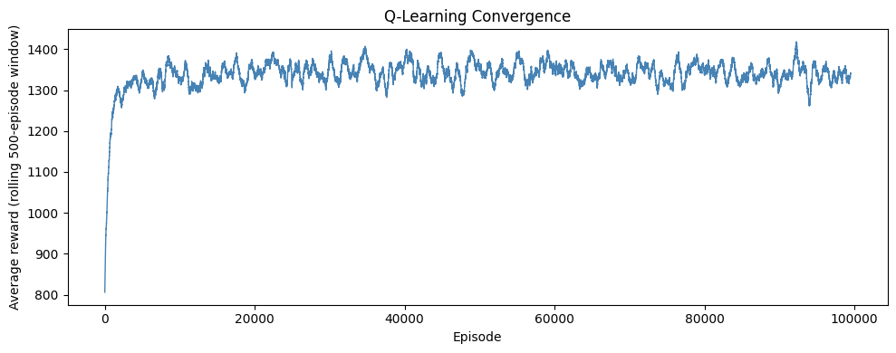
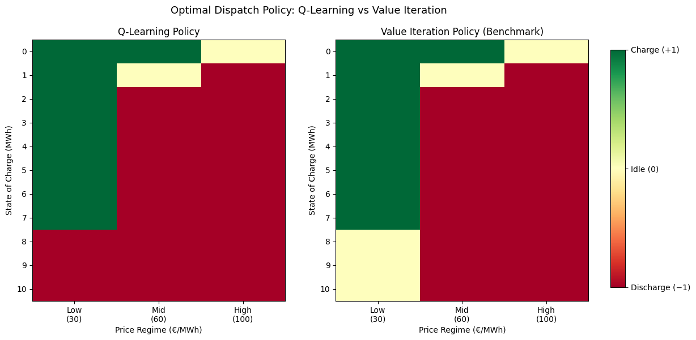
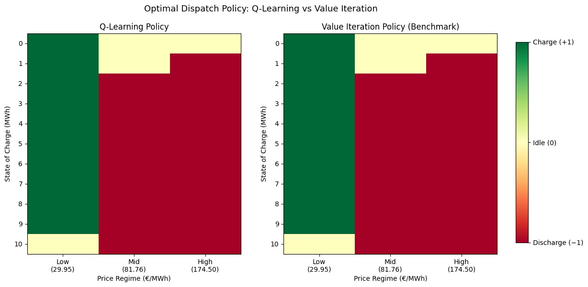
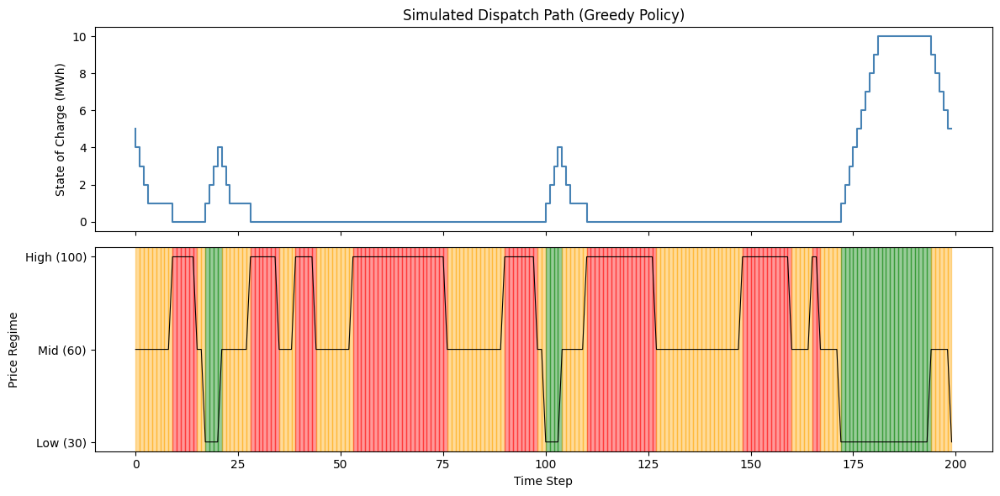

# Optimal Battery Storage Dispatch under Stochastic Electricity Prices
### A Q-Learning Approach 

---

## Repository Overview

This repository contains two versions of the battery storage dispatch model, progressing from a stylised proof-of-concept to a real-market implementation:

| Version | Notebook | Price Data | Transition Matrix | Q-Learning Gap |
|---------|----------|------------|-------------------|----------------|
| Stylised | `stylised_model.ipynb` | Hand-set (30 / 60 / 100 €/MWh) | Hand-set (diagonal = 0.6) | 1.1% |
| Real Data | `epex_realdata_model.ipynb` | EPEX Spot DE/LU 2020–2024 | Estimated from 43,848 observations | **0.0%** |

Data processing pipeline: `epex_data_processing.ipynb`

---

## Overview

This project models a battery storage operator as a reinforcement learning agent that learns an optimal dispatch policy through direct interaction with a stochastic electricity price environment — without requiring prior knowledge of price transition probabilities.

The core algorithm is **tabular Q-learning**, benchmarked against **Value Iteration** (the theoretical optimum under full information). The stylised version recovers **98.9%** of the Value Iteration benchmark reward. The real-data version, with two algorithmic improvements to handle high price persistence, achieves a gap of **0.0%**.

> **Context:** With the Energiewende driving rapid growth in renewable generation, electricity prices in wholesale markets (e.g. EPEX Spot) have become increasingly volatile. Efficient battery dispatch is a critical tool for grid stabilization and arbitrage — making this a practically relevant optimization problem.

---

## Problem Formulation

The battery operator's decision problem is modelled as a **Markov Decision Process (MDP)**:

| Component | Definition |
|-----------|-----------|
| **State** | (State of Charge, Price Regime) → 11 × 3 = 33 states |
| **Actions** | Charge (+1 MWh), Idle (0), Discharge (−1 MWh) |
| **Reward** | `r(SoC, p, a) = −p·a − c_deg·\|a\|` |
| **Degradation cost** | c_deg = 2.0 €/MWh |
| **Discount factor** | β = 0.95 |

---

## Stylised Version (`stylised_model.ipynb`)

### Price Process
The price regime follows a first-order Markov chain with hand-set parameters:

```
P = [[0.6, 0.3, 0.1],   # Low  → Low, Mid, High
     [0.2, 0.6, 0.2],   # Mid  → Low, Mid, High
     [0.1, 0.3, 0.6]]   # High → Low, Mid, High
```

Price levels: Low = 30 €/MWh, Mid = 60 €/MWh, High = 100 €/MWh

### Methodology

**1. Value Iteration (Benchmark)**
Solves the Bellman optimality equation iteratively using the known transition matrix P. Converges after **314 iterations**.

**2. Tabular Q-Learning**
Model-free, off-policy TD control with ε-greedy exploration (ε = 0.1).

| Parameter | Value |
|-----------|-------|
| Learning rate α | 0.1 (fixed) |
| Exploration rate ε | 0.1 (fixed) |
| Episodes | 100,000 |
| Steps per episode | 100 |
| Total Q-table updates | 10,000,000 |

### Results

| Method | Avg Reward/Step | vs. Optimum |
|--------|----------------|-------------|
| Value Iteration | 13.3436 €/MWh | 100% (benchmark) |
| Q-Learning | 13.2032 €/MWh | **98.9%** |




---

## Real-Data Version (`epex_realdata_model.ipynb`)

### Data Processing Pipeline (`epex_data_processing.ipynb`)

Raw data: German day-ahead electricity prices from [SMARD.de](https://www.smard.de) (Bundesnetzagentur), 2020–2024, hourly resolution (43,848 observations).

**Step 1 — Load and clean:** CSV with semicolon separators and German decimal notation (comma). Select DE/LU price column and parse timestamps.

**Step 2 — Exploratory analysis:** Two key structural features motivate using real data over a hand-crafted matrix:
- **2022 energy crisis:** Prices spiked above 800 €/MWh following the Russia-Ukraine war — far outside the stylised range of 30–100 €/MWh
- **Negative prices:** Observed in 2023, driven by excess renewable generation during low-demand periods

**Step 3 — Price discretisation:** Map continuous prices to Low / Mid / High using 33rd and 67th percentile quantiles as boundaries (q33 = 53.57 €/MWh, q67 = 108.30 €/MWh). Quantile-based boundaries ensure roughly equal state frequencies (~14,500 each), giving statistically stable transition estimates. A fixed boundary would risk highly unequal distributions given the skewed 2022 spike.

**Step 4 — Representative prices:** Within-state medians rather than means, because the 2022 spike makes the distribution heavily right-skewed. Median is robust to outliers.

**Step 5 — Transition matrix estimation:** Count observed hourly state transitions, normalise rows to sum to 1.

### Data Source
Real German day-ahead electricity prices from [SMARD.de](https://www.smard.de) (Bundesnetzagentur), 2020–2024, hourly resolution. Full processing pipeline in `epex_data_processing.ipynb`.

### Empirically Estimated Parameters

**Price levels** (within-state medians): Low = 29.95 €/MWh, Mid = 81.76 €/MWh, High = 174.50 €/MWh

**Transition matrix** (estimated from 43,848 hourly observations):

```
P = [[0.9359, 0.0637, 0.0003],   # Low  → Low, Mid, High
     [0.0621, 0.8571, 0.0808],   # Mid  → Low, Mid, High
     [0.0001, 0.0836, 0.9164]]   # High → Low, Mid, High
```

**Key finding:** Diagonal entries (~0.94 / 0.86 / 0.92) are substantially higher than the stylised value of 0.6. Real electricity prices exhibit strong **regime persistence** — the expected duration of a Low price spell is ~15.6 hours. This creates significant exploration challenges for Q-Learning.

### Algorithmic Improvements

Applying the stylised model's fixed ε = 0.1 and fixed α = 0.1 to real data produces a **69.2% gap** due to unequal state coverage under high price persistence. Two improvements address this:

**1. Epsilon decay:**
$$\varepsilon_t = \max\left(0.05,\ 0.5 \cdot \left(1 - \frac{t}{T}\right)\right)$$
More exploration early in training, converging to near-greedy behaviour later.

**2. Per-state-action adaptive learning rate:**
$$\alpha(s,a) = \frac{1}{n(s,a)^{0.6}}$$
where n(s,a) is the visit count for each state-action pair. Satisfies Q-Learning convergence conditions (Σα = ∞, Σα² < ∞). Rare state-action pairs retain high learning rates throughout training; frequently visited pairs stabilise quickly.

### Results

| Method | Avg Reward/Step | vs. Optimum |
|--------|----------------|-------------|
| Value Iteration | 10.1589 €/MWh | 100% (benchmark) |
| Q-Learning | 10.1589 €/MWh | **0.0%** |

**Optimal Dispatch Policy: Q-Learning vs Value Iteration**
Both policies are structurally identical — charge at Low prices, discharge at Mid/High prices, idle only at capacity constraints. The per-state adaptive learning rate ensures even rare state-action combinations are learned correctly.



**Simulated Dispatch Path (Greedy Policy, 200 steps)**
SoC rises during Low price periods (green) and falls during Mid/High periods (orange/red), confirming the charge-low, discharge-high arbitrage logic. During the extended Low price spell at step ~175, the agent charges to full capacity (SoC = 10) — correctly anticipating the subsequent high-price discharge opportunity.



---

## Repository Structure

```
battery-storage-dispatch-rl/
│
├── stylised_model.ipynb                               # Stylised model (full derivations + implementation
├── epex_data_processing.ipynb                         # Data processing pipeline
├── epex_realdata_model.ipynb                          # Real-data extension (EPEX Spot 2020–2024)
├── stylised_convergence.png                           # Stylised model convergence plot
├── stylised_policy_heatmap.png                        # Stylised model policy heatmap
├── epex_policy_heatmap.png                            # Real-data model policy heatmap
├── epex_dispatch.png                                  # Real-data simulated dispatch path
└── README.md
```

---

## Key Takeaways

1. **Model-free RL is viable** for energy storage dispatch even without knowledge of price transition probabilities
2. **Real electricity prices exhibit far stronger regime persistence** than stylised models assume — this requires algorithmic adaptation
3. **Per-state-action adaptive learning rate** directly solves the unequal state coverage problem caused by high price persistence, reducing the gap from 69.2% to 0.0%
4. **Degradation costs** materially affect the optimal idle threshold — a practically relevant finding for battery lifetime management

---

## Technical Stack

- **Language:** Python 3.12
- **Libraries:** NumPy, Pandas, Matplotlib
- **Algorithms:** Tabular Q-Learning, Value Iteration
- **Data source:** SMARD.de (Bundesnetzagentur)
- **Random seed:** 42 (fixed for reproducibility)

---

## Academic Context

Developed as part of the module (Dynamic Optimization and Reinforcement Learning) at the University of Münster, M.Sc. Economics 

---

## Author

**Xin Sui**
M.Sc. Economics | University of Münster
